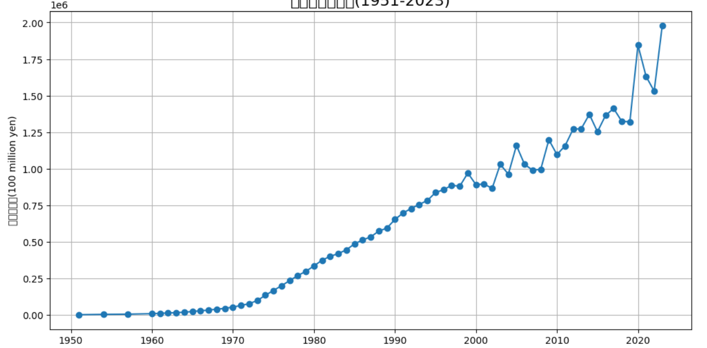

＃＃　プロジェクト概要

厚生労働省の統計データを用いて、日本の社会保険料の長期的な推移を分析する。 社会保険制度の持続が可能か、少子高齢化の影響について考察することを目的とする。

＃＃使用ツール

・Python(pandas, matplotlib)

・Google Colab

・データ：　厚生労働省「社会保障財源（ILO基準）」より

＃＃　分析手順

１，Excelファイルを読み込む

２，年度ごとの社会保険料合計を可視化する

３，グラフの傾向を確認し、社会的要因と関連付けて考察する

# 日本社会保険料の推移分析

